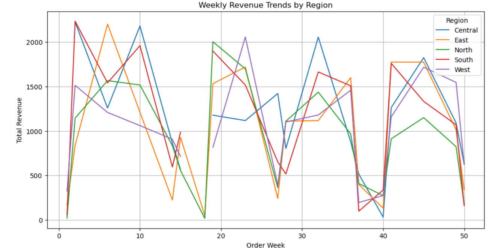
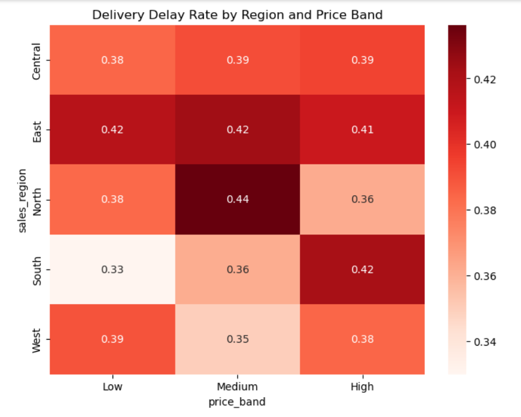

# Green Cart Ltd. | Sales & Customer Behaviour Insights

## Project Snapshot
This project analyses sales and customer behaviour for **Green Cart Ltd.**, a UK-based e-commerce company specialising in eco-friendly household products.

Using Python, I cleaned and merged sales, product, and customer datasets to uncover trends in revenue, loyalty value, discount performance, delivery delays, and regional behaviour. The final output combined technical analysis with business-focused recommendations for a non-technical audience.

## Business Problem
Green Cart Ltd. needed clearer insight into:

- which product categories generate the most revenue
- whether discounts increase sales volume
- which customer segments create the most value
- where delivery performance is falling behind
- how customer signup patterns relate to purchasing behaviour

## What I Delivered
- cleaned and standardised raw datasets
- merged sales, product, and customer data into one analytical dataset
- engineered new features such as revenue, order week, price band, days to order, email domain, and delay flag
- created summary tables and visualisations
- answered key business questions from the brief
- produced practical recommendations based on the findings

## Tools Used
- Python
- Pandas
- NumPy
- Matplotlib
- Seaborn
- Jupyter Notebook

## Analysis Areas
- revenue trends by region
- product category performance
- customer value by loyalty tier
- delivery delay analysis
- payment method preferences
- discount effectiveness
- signup behaviour patterns

## Key Findings
- The **Cleaning** category was the strongest revenue driver.
- **Gold** loyalty customers generated the highest overall value.
- Discounts did **not** show a meaningful link with higher quantity sold.
- Delivery delays were more visible in the **East** and **North** regions.
- Customer activity appeared stronger in **Q4**, suggesting seasonal demand patterns.

## Sample Visuals

### Weekly Revenue Trend by Region
This chart shows how revenue changed over time across regions and highlights the strongest performing periods.

### Delivery Delay Heatmap by Region and Price Band
This heatmap highlights where delivery delays were highest, helping identify operational problem areas.

## Business Recommendations
- reduce unnecessary discounting and focus on value-led promotions
- investigate operational causes of delivery delays in weaker regions
- strengthen retention and upgrade paths for high-value loyalty customers
- prepare inventory and fulfilment planning ahead of stronger Q4 demand

## Repository Contents
- `green-cart-sales-customer-insights.ipynb` — full notebook with cleaning, feature engineering, analysis, and visualisations
- `Green_Cart_Report1.pdf` — final report with findings and recommendations
- `README.md` — project summary

## Why This Project Matters
This project demonstrates my ability to take a business question from raw data through to insight and recommendation. It reflects core data analyst skills including data cleaning, feature engineering, exploratory analysis, visual storytelling, and translating findings into clear business actions.

## Author
**Tashmin Hasan**  
Aspiring Data Analyst Portfolio | Python | SQL | Power BI | Tableau
